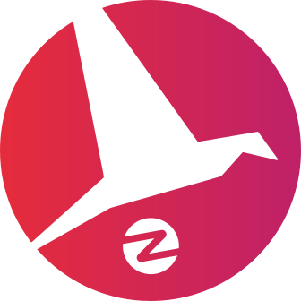

    

  

<h1 align="center">Cheat sheet : Promouvoir un projet open-source</h1>

> Ce cheat sheet résume les étapes importantes à suivre pour promouvoir un projet open-source dans les meilleures conditions. Il est possible d’afficher des informations supplémentaires pour un élément de la liste en cliquant dessus.

Langages disponibles :

- [English](./README.md)
- [Français](./README-fr.md)
- [Deutsch](./README-de.md)
- [Español](./README-es.md)
- [简体中文](./README-zh-cn.md)
- [繁體中文](./README-zh-tw.md)
- [پارسی](./README-fa.md)
- [Português](./README-pt.md)
- [Türkçe](./README-tr.md)
- [Català](./README-ca.md)
- [日本語](./README-jp.md)
- [සිංහල](./README-si.md)

Une langue est manquante ? Vous pensez qu'il est possible d'améliorer ce cheat sheet ? [Les contributions sont les bienvenues](./CONTRIBUTING.md) !

## 1. 🎢 Préparation

 

👌 S'assurer que le projet soit assez mature

> Assurez-vous que votre projet soit stable et possède un minimum de fonctionnalités intéressantes pour accrocher les visiteurs.

😎 Choisir un nom cool pour son projet

> Choisissez un nom que vos visiteurs pourront facilement retenir.

💅 Soigner la présentation du README

> Le README est la première chose que les visiteurs verront sur la page de votre projet. Travaillez la présentation pour qu'elle soit simple, jolie et agréable à lire. [Vous trouverez des exemples de README soignés ici.](https://github.com/matiassingers/awesome-readme)

💪 Mettre en avant les points forts du projet

> Identifiez les points forts de votre projet et mettez-les en avant de manière à ce que ce soit la première chose que voient vos visiteurs.

✨ Mettre une démo du projet à disposition

> Vos visiteurs voudront comprendre rapidement à quel besoin répond votre projet et comment il fonctionne. Mettre une démo à disposition est un excellent moyen de satisfaire vos visiteurs. Le format de la démo peut être :
>
> - un GIF animé
> - un lien vers une démo en ligne

👌 L'installation et l'utilisation du projet doivent être les plus simples possibles

> Vous risquez de perdre des visiteurs si le projet n'est pas simple à installer ou à utiliser.

📘 Créer une documentation soignée et structurée

> Créer une bonne documentation est probablement l'étape la plus importante. Si votre documentation n'est pas longue, vous pouvez l'inclure directement dans votre README. Si celle-ci est volumineuse, le mieux sera de l'héberger sur un site différent. Certains projets open-source comme [vuepress](https://v1.vuepress.vuejs.org) permettent de créer rapidement une jolie documentation.

 

 

## 2. 📢 Communiquer le projet

 

⭐ Mettre en confiance les futurs visiteurs avant de publier sur les réseaux sociaux

> La plupart des visiteurs regarderont le nombre de stars du projet avant de l'utiliser. Plus votre projet possède un nombre important de stars, plus son indice de fiabilité sera élevé. N'hésitez pas à demander à vos proches, collègues et amis de vous aider à améliorer la crédibilité de votre projet en ajoutant une star.

↗️ Partager le projet sur les réseaux sociaux et les plateformes spécialisées

> Voici quelques plateformes sur lesquelles vous pourriez partager votre travail :
>
> - [Twitter](https://twitter.com)
> - [Linkedin](https://www.linkedin.com/)
> - [Facebook](https://www.facebook.com/)
> - [Reddit](https://www.reddit.com/)
> - [Dev.to](https://dev.to/)
> - [Lobsters](https://lobste.rs/)
> - [Hacker News](https://news.ycombinator.com/)
> - [Product Hunt](https://www.producthunt.com/)
> - [Beta page](https://betapage.co/)
> - [Human Coders](https://news.humancoders.com/)

📃 Écrire des articles en mentionnant le projet

> Écrivez des articles et citez votre projet. Le sujet de l'article peut être lié à la stack technique que vous avez utilisée, les problèmes que vous avez rencontrés, etc. Postez sur les plateformes de publication :
>
> - [medium](https://medium.com/)
> - [dev.to](https://dev.to/)

🎤 Présenter le projet à des conférences/meetups

> La présentation de votre projet à des conférences et meetups est un excellent moyen d'améliorer sa visibilité.

🎥 Enregistrer et publier des vidéos de présentation du projet

> Enregistrez une vidéo n'est pas un exercice facile, cependant c'est l'un des moyens les plus efficaces pour rendre votre projet populaire.

🕐 Choisir le meilleur moment pour publier sur les réseaux sociaux

> Habituellement, le meilleur moment pour lancer une communication est en milieu de semaine. Ne faites pas de communication pendant les périodes de vacances ou le week-end.

🗑 Ne pas spammer les plateformes avec la promotion du projet

> Ne publiez pas deux fois sur la même plateforme. Votre communication pourra être considérée comme du spam et causer de la mauvaise publicité pour votre projet.

 

## 3. 🤝 Garder les utilisateurs

 

🆕 Mettre régulièrement à jour le projet

> Maintenez et améliorez votre projet en publiant de nouvelles versions. N'oubliez pas de générer les changelogs associés.

❗ Maintenir le projet et traiter les issues ouvertes

> Ne laissez pas les issues sans réponse. Soyez courtois et sympathique avec les personnes qui ont pris le temps d'ouvrir des issues. 😉

🙏 Inviter les utilisateurs à contribuer

> Un projet en bonne santé est un projet qui possède une communauté et des contributeurs. Montrez à vos utilisateurs que leur aide est la bienvenue en taggant certaines issues avec les labels `contribution welcome` ou `good first issue`. [Vous trouverez plus d'information sur les labels en cliquant ici.](https://help.github.com/en/articles/about-labels)

🏆 Récompenser les contributeurs

> Certains projets open-source comme [gatsby](https://github.com/gatsbyjs/gatsby) récompensent leurs contributeurs avec des goodies. Si vous n'en n'avez pas les moyens, faites une publication (sur twitter ou d'autres plateformes) qui mentionne la contribution et son auteur afin de le remercier (ex. : [Post sur twitter](https://twitter.com/FranckAbgrall/status/1139470547492978688)). Vous pouvez aussi ouvrir une section `Contributors` sur votre README afin d'afficher publiquement votre gratitude envers vos contributeurs ou encore les mettre en avant sur le site ou la documentation de votre projet.
>
> - [vuepress (section contributeurs dans le README)](https://github.com/vuejs/vuepress#code-contributors)
> - [Rythm.js (Mise en avant de manière aléatoire d'un contributeur sur la page de démo)](https://okazari.github.io/Rythm.js/)

💬 Ouvrir un chat pour la communauté du projet

> Les issues Github ne sont pas toujours la meilleure manière de communiquer avec vos utilisateurs. Si nécessaire, vous pouvez ouvrir un chat pour discuter avec eux :
>
> - [Discord](https://discordapp.com)
> - [Slack](https://slack.com)
> - [Gitter](https://gitter.im/)

🔙 Demander des retours utilisateurs

> Les retours des utilisateurs sont un excellent moyen d'améliorer votre projet. Vos utilisateurs ont probablement un tas d'idées qui pourraient rendre votre projet meilleur.

 

❤️ Montrer ce que les autres utilisateurs ont créé avec votre projet

> Les visiteurs accorderont plus facilement leur confiance s'ils voient des cas concrets d'utilisation (ex. : [vuepress gallery](https://vuepress.gallery/)).

 

## 🙏 Montrez votre support

N'hésitez pas à mettre une ⭐ si ce projet vous a aidé.

## ❤️ Contributeurs

Merci à tous les formidables contributeurs:

<!-- ALL-CONTRIBUTORS-LIST:START - Do not remove or modify this section -->
<!-- prettier-ignore-start -->
<!-- markdownlint-disable -->
<table>
  <tr>
    <td align="center"><a href="https://www.franck-abgrall.me/"> <b>Franck Abgrall</b></a> <a href="https://github.com/zenika-open-source/promote-open-source-project/commits?author=kefranabg" title="Documentation">📖</a></td>
    <td align="center"><a href="https://github.com/tbetous"> <b>Thomas Betous</b></a> <a href="https://github.com/zenika-open-source/promote-open-source-project/commits?author=tbetous" title="Documentation">📖</a></td>
    <td align="center"><a href="https://github.com/ebriand"> <b>Eric Briand</b></a> <a href="https://github.com/zenika-open-source/promote-open-source-project/commits?author=ebriand" title="Documentation">📖</a></td>
    <td align="center"><a href="https://github.com/FofoDev"> <b>Faustine Godbillot</b></a> <a href="https://github.com/zenika-open-source/promote-open-source-project/commits?author=FofoDev" title="Documentation">📖</a></td>
    <td align="center"><a href="https://myvirtualstorybook.com/"> <b>Benjamin Plouzennec</b></a> <a href="https://github.com/zenika-open-source/promote-open-source-project/commits?author=Okazari" title="Documentation">📖</a></td>
    <td align="center"><a href="https://github.com/Zenigata"> <b>Johan Bonneau</b></a> <a href="https://github.com/zenika-open-source/promote-open-source-project/commits?author=Zenigata" title="Documentation">📖</a></td>
    <td align="center"><a href="https://github.com/bpetetot"> <b>Benjamin Petetot</b></a> <a href="https://github.com/zenika-open-source/promote-open-source-project/commits?author=bpetetot" title="Documentation">📖</a></td>
  </tr>
  <tr>
    <td align="center"><a href="https://nick-hat-boecker.de"> <b>NickHatBoecker</b></a> <a href="#translation-NickHatBoecker" title="Translation">🌍</a></td>
    <td align="center"><a href="https://github.com/Claire"> <b>Claire Martinez</b></a> <a href="#translation-claire" title="Translation">🌍</a></td>
    <td align="center"><a href="https://hazeforum.com/"> <b>André Gama</b></a> <a href="https://github.com/zenika-open-source/promote-open-source-project/commits?author=andregamma" title="Documentation">📖</a></td>
    <td align="center"><a href="https://github.com/mbernardeau"> <b>Mathias Bernardeau</b></a> <a href="https://github.com/zenika-open-source/promote-open-source-project/commits?author=mbernardeau" title="Documentation">📖</a></td>
    <td align="center"><a href="https://github.com/Antoineoili"> <b>Antoine Oili</b></a> <a href="https://github.com/zenika-open-source/promote-open-source-project/commits?author=Antoineoili" title="Documentation">📖</a></td>
    <td align="center"><a href="https://twitter.com/dev_oswld"> <b>Oswld TC</b></a> <a href="#translation-dev-oswld" title="Translation">🌍</a></td>
    <td align="center"><a href="https://yizhiyue.me"> <b>Zhiyue Yi</b></a> <a href="#translation-ZhiyueYi" title="Translation">🌍</a></td>
  </tr>
  <tr>
    <td align="center"><a href="https://github.com/aliruss"> <b>Ali khalili</b></a> <a href="#translation-aliruss" title="Translation">🌍</a></td>
    <td align="center"><a href="https://pakseresht.eu/"> <b>Niusha Pakseresht</b></a> <a href="#translation-niusha-paks" title="Translation">🌍</a></td>
    <td align="center"><a href="https://github.com/david-dasilva"> <b>David Da Silva</b></a> <a href="#translation-david-dasilva" title="Translation">🌍</a></td>
    <td align="center"><a href="http://umuts.info"> <b>Umut Işık</b></a> <a href="#translation-umutphp" title="Translation">🌍</a></td>
    <td align="center"><a href="https://github.com/alextremp"> <b>Alex Castells</b></a> <a href="#translation-alextremp" title="Translation">🌍</a></td>
    <td align="center"><a href="https://kojikoji.ga"> <b>Koji</b></a> <a href="#translation-koji" title="Translation">🌍</a></td>
    <td align="center"><a href="https://github.com/MasterBrian99"> <b>pasindu p konghawaththa</b></a> <a href="#translation-MasterBrian99" title="Translation">🌍</a></td>
  </tr>
</table>

<!-- markdownlint-enable -->
<!-- prettier-ignore-end -->
<!-- ALL-CONTRIBUTORS-LIST:END -->

Ce projet suit la spécification [all-contributors](https://github.com/all-contributors/all-contributors). Les contributions de tout type sont les bienvenues !

