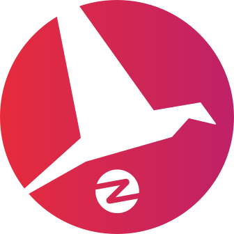

    

  

<h1 align="center">Open source promotion cheat sheet</h1>

> This cheat sheet summarizes important steps you should follow to promote your open source project in the best conditions. You can click items to expand and get more information from a topic. 

List of available languages:

- [English](./README.md)
- [Français](./README-fr.md)
- [Deutsch](./README-de.md)
- [Español](./README-es.md)
- [简体中文](./README-zh-cn.md)
- [繁體中文](./README-zh-tw.md)
- [پارسی](./README-fa.md)
- [Português](./README-pt.md)

A language is missing? Want to improve this cheat sheet? [Contributions are welcome](./CONTRIBUTING.md)!

[A PDF version of this cheat sheet is available here.](./pdf/cheat-sheet.pdf)

## 1. 🎢 Preparation step

 

👌 Make sure your project is mature enough

> Your project must be stable enough with minimum viables features in order to hook users.

😎 Choose a cool name for your project

> Choose a name users can easily remember.

💅 Make your README pretty

> README is the first thing your vistors will see. Make it simple, pretty and easy to read. [Here is a list of beautiful READMEs](https://github.com/matiassingers/awesome-readme).

💪 Highlight strong points of your project

> Identify your project strengths and make sure visitors see them first.

✨ Provide a demo of your project

> Visitors will want to quickly understand the purpose of your project, how it works and how to use it. Providing a demo is the best way to satisfy users. It could be:
>
> - An animated GIF demonstrating how your project works
> - A link to a live demo

👌 Install/Usage must be super easy

> You'll probably lose visitors if your project is not user-friendly.

📘 Create a clean and well structured documentation

> Creating a good documentation is probably the most important step. If you have a small documentation, you can include it within your README. Otherwise, you should probably host it in a separate website. Some open source projects like [vuepress](https://v1.vuepress.vuejs.org) can help you creating clean documentation in a simple way.

 

 

## 2. 📢 Spread the word about your hard works

 

⭐ Make your project trustable before publishing it on social networks

> Most visitors will check how many stars the project has before considering using it. A minimum amount of stars makes your project more trustable than a project with zero star. This is why you should ask people you know to support your project before doing a public announcement on social media.

↗️ Share the project on social media and specialized platforms

> Tell the World about your awesome work! Publish on social media and specialized platforms:
>
> - [Twitter](https://twitter.com)
> - [Linkedin](https://www.linkedin.com/)
> - [Facebook](https://www.facebook.com/)
> - [Reddit](https://www.reddit.com/)
> - [Dev.to](https://dev.to/)
> - [Lobsters](https://lobste.rs/)
> - [Hacker News](https://news.ycombinator.com/)
> - [Product Hunt](https://www.producthunt.com/)
> - [Beta page](https://betapage.co/)
> - [Human Coders](https://news.humancoders.com/)

📃 Write articles that mention your project

> Write articles about your project. Purpose can be the technical stack you used, how your project works, problems you encountered, etc. Post to publishing platforms:
>
> - [medium](https://medium.com/)
> - [dev.to](https://dev.to/)

🎤 Present your project at conferences/meetups

> Presenting your project at conferences or meetups is a good way to improve its visibility.

🎥 Record and publish videos presenting your project, how it works, etc

> Recording a video is not an easy exercise. However it's probably the most efficient way to make your project famous.

🕐 Choose the best time to publish on social media

> Don't publish during holidays period or weekends. Usually the best time to publish on social networks is mid-week.

🗑 Don't spam platforms with your promotion

> Don't publish twice on the same platform. It will be considered as spam and might cause bad publicity for your project.

 

## 3. 🤝 Keep your users

 

🆕 Try to regularly release new versions of your project

> Maintain and improve your project with new releases and generate changelogs.

❗ Maintain your project, process opened issues

> Do not let opened issues without response. Be nice with people that took time to open issues. 😉

🙏 Invite users to contribute

> A healthy project is a project with a community and contributors. Let your users know that you need help by tagging some issues with `contribution welcome` or `good first issue` labels. [See github labels](https://help.github.com/en/articles/about-labels).

🏆 Reward contributors

> Be nice with people that helped you! Some open source projects like [gatsby](https://github.com/gatsbyjs/gatsby) reward contributors with goodies. If you can't afford that, do a public post (on twitter or other platforms) about the contribution and mention the author ([here is an example of public thanks](https://twitter.com/FranckAbgrall/status/1139470547492978688)). Open a `Contributors` section in your README to publicly thank them or showcase them on your project documentation or website. Here are some examples:
>
> - [vuepress (contributors README section)](https://github.com/vuejs/vuepress#code-contributors)
> - [Rythm.js (random highlighted contributor on demo page)](https://okazari.github.io/Rythm.js/)

💬 Open a community chat platform

> Github issues are not always the best way to communicate with your users. If necessary, you can use chat platforms to discuss with them:
>
> - [Discord](https://discordapp.com)
> - [Slack](https://slack.com)
> - [Gitter](https://gitter.im/)

🔙 Ask for feedback

> User feedback is the best way to improve your project. They probably have features and ideas that could make your project better.

❤️ Open a use case gallery to show what users built with your project

> Visitors will trust your project if they see concrete use cases and success stories, e.g., [the vuepress gallery](https://vuepress.gallery/)).

 

## 🙏 Show your support

⭐️ this repository if this cheat sheet helped you!

 

## ❤️ Contributors

Thanks go to these wonderful people:

<!-- ALL-CONTRIBUTORS-LIST:START - Do not remove or modify this section -->
<!-- prettier-ignore -->
<table>
  <tr>
    <td align="center"><a href="https://www.franck-abgrall.me/"> <b>Franck Abgrall</b></a> <a href="https://github.com/zenika-open-source/open-source-promotion-cheat-sheet/commits?author=kefranabg" title="Documentation">📖</a></td>
    <td align="center"><a href="https://github.com/tbetous"> <b>Thomas Betous</b></a> <a href="https://github.com/zenika-open-source/open-source-promotion-cheat-sheet/commits?author=tbetous" title="Documentation">📖</a></td>
    <td align="center"><a href="https://github.com/ebriand"> <b>Eric Briand</b></a> <a href="https://github.com/zenika-open-source/open-source-promotion-cheat-sheet/commits?author=ebriand" title="Documentation">📖</a></td>
    <td align="center"><a href="https://github.com/FofoDev"> <b>Faustine Godbillot</b></a> <a href="https://github.com/zenika-open-source/open-source-promotion-cheat-sheet/commits?author=FofoDev" title="Documentation">📖</a></td>
    <td align="center"><a href="https://myvirtualstorybook.com/"> <b>Benjamin Plouzennec</b></a> <a href="https://github.com/zenika-open-source/open-source-promotion-cheat-sheet/commits?author=Okazari" title="Documentation">📖</a></td>
    <td align="center"><a href="https://github.com/Zenigata"> <b>Johan Bonneau</b></a> <a href="https://github.com/zenika-open-source/open-source-promotion-cheat-sheet/commits?author=Zenigata" title="Documentation">📖</a></td>
    <td align="center"><a href="https://github.com/bpetetot"> <b>Benjamin Petetot</b></a> <a href="https://github.com/zenika-open-source/open-source-promotion-cheat-sheet/commits?author=bpetetot" title="Documentation">📖</a></td>
  </tr>
  <tr>
    <td align="center"><a href="https://nick-hat-boecker.de"> <b>NickHatBoecker</b></a> <a href="#translation-NickHatBoecker" title="Translation">🌍</a></td>
    <td align="center"><a href="https://github.com/Claire"> <b>Claire Martinez</b></a> <a href="#translation-claire" title="Translation">🌍</a></td>
    <td align="center"><a href="https://hazeforum.com/"> <b>André Gama</b></a> <a href="https://github.com/zenika-open-source/open-source-promotion-cheat-sheet/commits?author=andregamma" title="Documentation">📖</a></td>
    <td align="center"><a href="https://github.com/mbernardeau"> <b>Mathias Bernardeau</b></a> <a href="https://github.com/zenika-open-source/open-source-promotion-cheat-sheet/commits?author=mbernardeau" title="Documentation">📖</a></td>
    <td align="center"><a href="https://github.com/Antoineoili"> <b>Antoine Oili</b></a> <a href="https://github.com/zenika-open-source/open-source-promotion-cheat-sheet/commits?author=Antoineoili" title="Documentation">📖</a></td>
    <td align="center"><a href="https://twitter.com/dev_oswld"> <b>Oswld TC</b></a> <a href="#translation-dev-oswld" title="Translation">🌍</a></td>
    <td align="center"><a href="https://yizhiyue.me"> <b>Zhiyue Yi</b></a> <a href="#translation-ZhiyueYi" title="Translation">🌍</a></td>
  </tr>
  <tr>
    <td align="center"><a href="https://github.com/aliruss"> <b>Ali khalili</b></a> <a href="#translation-aliruss" title="Translation">🌍</a></td>
    <td align="center"><a href="https://pakseresht.eu/"> <b>Niusha Pakseresht</b></a> <a href="#translation-niusha-paks" title="Translation">🌍</a></td>
    <td align="center"><a href="https://github.com/david-dasilva"> <b>David Da Silva</b></a> <a href="#translation-david-dasilva" title="Translation">🌍</a></td>
  </tr>
</table>

<!-- ALL-CONTRIBUTORS-LIST:END -->

This project follows the [all-contributors](https://github.com/all-contributors/all-contributors) specification. Contributions of any kind welcome!
